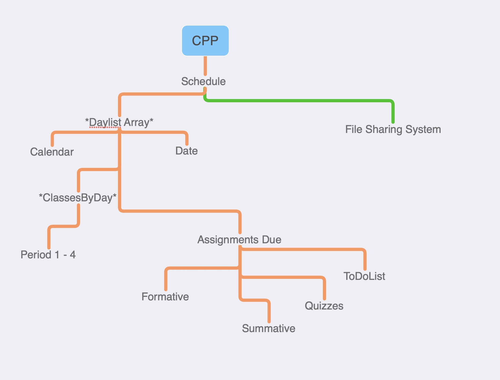

# CSP Project Description

## Table of Contents

- [Mission Statement](#mission-statement)
- [Hierarchy](#hierarchy)
- [Usage](#usage)
- [Progress](#progress)
- Beta

## Mission Statement

*in development* 

IB CS SL Class Project, base code written in *java*  

Lorem ipsum dolor sit amet, consectetur adipiscing elit, sed do eiusmod tempor incididunt ut labore et dolore magna aliqua. Ut enim ad minim veniam, quis nostrud exercitation ullamco laboris nisi ut aliquip ex ea commodo consequat. Duis aute irure dolor in reprehenderit in voluptate velit esse cillum dolore eu fugiat nulla pariatur. Excepteur sint occaecat cupidatat non proident, sunt in culpa qui officia deserunt mollit anim id est laborum

## Hierarchy


## Usage
Create your separate branch for your features.
```bash
git branch yourFeature
git checkout youFeature
```

Put your source code in the src folder.

- The package for the Subject class is *main*.
- Create your own package for your features.

Compile your java files with
```bash
./build.sh
```

To run the main class, do
```bash
./build.sh run
```

To clean the binaries, do 
```bash
./build clean
```

Subject.java provides the constructor Subject.
Main.java provides the main loop.

## Progress

Contributor | Task         |
----------- | ------------ |
Cobbi       | [ ] Todolist |
Uzen        | [ ] Database |
Jerry       | [ ] Calendar |
